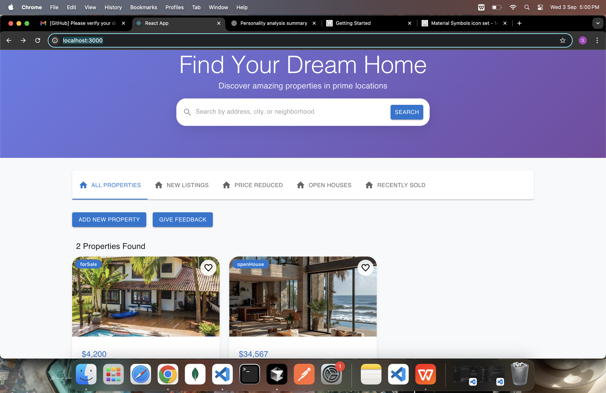

# 🚀 Real Estate Property Management Frontend

A modern, responsive frontend application for a real estate platform, built with React, Redux, and Material-UI.

---

## ✨ Features
- **Property Listings**: View a list of available properties with key information.
- **Detailed Property View**: See comprehensive details for each property, including an image carousel, pricing, location map, and amenities.
- **Create Property Listings**: A multi-step form to easily create new property listings.
- **Interactive Map**: A draggable marker to pinpoint the exact location of a property.
- **Responsive Design**: Works seamlessly on both desktop and mobile devices.

---

## 🛠️ Tech Stack
- **Frontend:** React, Redux Toolkit, React Router, Material-UI
- **Mapping:** React Leaflet
- **Notifications:** Notistack

---

## 📸 Screenshots / Demo

*(Add images or GIFs of your app here to showcase its features.)*



---

## ⚡ Getting Started

### Prerequisites
- Node.js (v14 or later)
- npm (v6 or later)

### Installation & Running
1. Clone the repo:
   ```sh
   git clone https://github.com/Sufal-Shirodkar/real-estate-property-management-frontend.git
   ```
2. Navigate to the project directory and install dependencies:
   ```sh
   cd real-estate-property-management-frontend
   npm install
   ```
3. Start the development server:
   ```sh
   npm start
   ```
The application will be available at [http://localhost:3000](http://localhost:3000).

---

## 📂 Project Structure
```
/src
|-- /component       # Reusable UI components
|   |-- /steps       # Components for the multi-step form
|-- /config          # Configuration files (e.g., ImageKit)
|-- /features        # Core feature components/pages
|-- /services        # API service layer for backend communication
|-- /store           # Redux store and slice configurations
|-- App.js           # Main application component with routing
|-- index.js         # Entry point of the application
```
